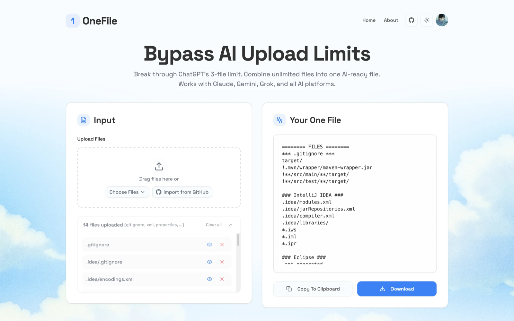

# OneFile 🚀

> Combine multiple files into one AI-ready prompt effortlessly.

OneFile is a free, open-source tool that solves common frustrations when working with AI platforms:

- 😫 Tired of hitting file upload limits on ChatGPT, Claude, or Gemini?
- 🔄 Manually uploading the same files repeatedly to different AI assistants?
- 📁 Can't upload entire folders to get comprehensive help?
- 📚 Need to combine study materials, research papers, or project documents?

**OneFile** solves these issues by combining multiple files (code, PDFs, docs, CSVs, etc.) into a single, well-formatted prompt that you can use anywhere. It intelligently processes your files while skipping unnecessary content like dependencies and build artifacts.



## ✨ Features

- 📁 **Universal File Support**: Combine any file type - PDFs, Word docs, spreadsheets, code files, text files, and more
- 🎯 **Smart Processing**: Automatically handles multiple file formats while preserving structure and relationships
- 🚫 **Intelligent Filtering**: Automatically filters out binary files, dependencies, and other non-text content
- 📋 **Easy Export**: Copy to clipboard or download your formatted prompts with a single click
- 🌐 **Completely FREE & open-source!**

## 🎯 Perfect For

- **Students**: Combine lecture slides, study guides, and assignments for AI-powered study help
- **Researchers**: Merge research papers, drafts, and notes for thesis/dissertation feedback
- **Business Professionals**: Gather emails, meeting notes, and project docs for AI-assisted meeting prep
- **Data Analysts**: Combine CSVs and data files for AI-driven pattern analysis
- **Legal Professionals**: Aggregate case files, precedents, and evidence for AI-powered legal research
- **Entrepreneurs**: Merge competitor analysis, market research, and financials for AI-generated business pitches
- **Developers**: Transform code files into AI-ready prompts for code review and analysis

## 🚀 Getting Started

### Prerequisites

- Node.js 18+ 
- npm or yarn

### Installation

1. Clone the repository:
```bash
git clone https://github.com/wahibonae/onefile.git
cd onefile
```

2. Install dependencies:
```bash
npm install
# or
yarn install
```

3. Start the development server:
```bash
npm run dev
# or
yarn dev
```

4. Open [http://localhost:3000](http://localhost:3000) in your browser

## 🎯 Usage

1. **Enter Your Prompt**: Start by typing your prompt or question in the input field
2. **Add Files**: Either:
   - Drag and drop files/folders into the upload area
   - Click "Choose Files" to select individual files
   - Click "Choose Folder" to select an entire directory
3. **Generate**: Your AI-ready prompt is generated automatically
4. **Export**: Either:
   - Copy the generated prompt to your clipboard
   - Download it as a text file

## 📝 Example Scenarios

- **Student**: "I have 15 PDF lecture slides, 8 study guides, and 12 homework assignments – I want ChatGPT to create practice questions but can't upload them all at once."

- **Data Analyst**: "I have many CSV files from different months/regions and want AI to find patterns, but I can only upload a few at a time and lose context between conversations."

- **Business Professional**: "I have emails, previous meeting notes, project docs, and agenda items scattered across 25+ files – I need AI to help me prepare but keep hitting limits."

- **Researcher**: "I want to combine multiple research papers and my draft thesis chapter to get AI feedback on my literature review."

## 🛠️ Built With

- [Next.js](https://nextjs.org/) - React framework
- [Tailwind CSS](https://tailwindcss.com/) - Styling
- [Shadcn/ui](https://ui.shadcn.com/) - UI components
- [Lucide Icons](https://lucide.dev/) - Icons
- [React Hot Toast](https://react-hot-toast.com/) - Notifications

## 🤝 Contributing

Contributions are what make the open source community such an amazing place to learn, inspire, and create. Any contributions you make are **greatly appreciated**.

1. Fork the Project
2. Create your Feature Branch (`git checkout -b feature/AmazingFeature`)
3. Commit your Changes (`git commit -m 'Add some AmazingFeature'`)
4. Push to the Branch (`git push origin feature/AmazingFeature`)
5. Open a Pull Request

Please make sure to update tests as appropriate and adhere to the existing coding style.

## 📝 License

This project is licensed under the MIT License - see the [LICENSE](LICENSE) file for details.

## 👤 Author

**ABKARI Mohamed Wahib**

- GitHub: [@wahibonae](https://github.com/wahibonae)
- Twitter: [@wahibonae](https://twitter.com/wahibonae)
- LinkedIn: [Mohamed Wahib ABKARI](https://www.linkedin.com/in/abkarimohamedwahib/)

## 🙏 Acknowledgments

- Thanks to everyone who inspired us to build OneFile
- Thanks to the community for the support and feedback
- Inspired by the need to streamline AI interactions with multiple files

## 📊 Roadmap

- [ ] Custom ignore patterns
- [ ] Prompt templates for different use cases
- [ ] Multiple output formats for different AI models
- [ ] API endpoint for programmatic access
- [ ] Batch processing for large file sets
- [ ] Integration with popular cloud storage services

---

<p align="center">Made with ❤️ by wahib</p>
